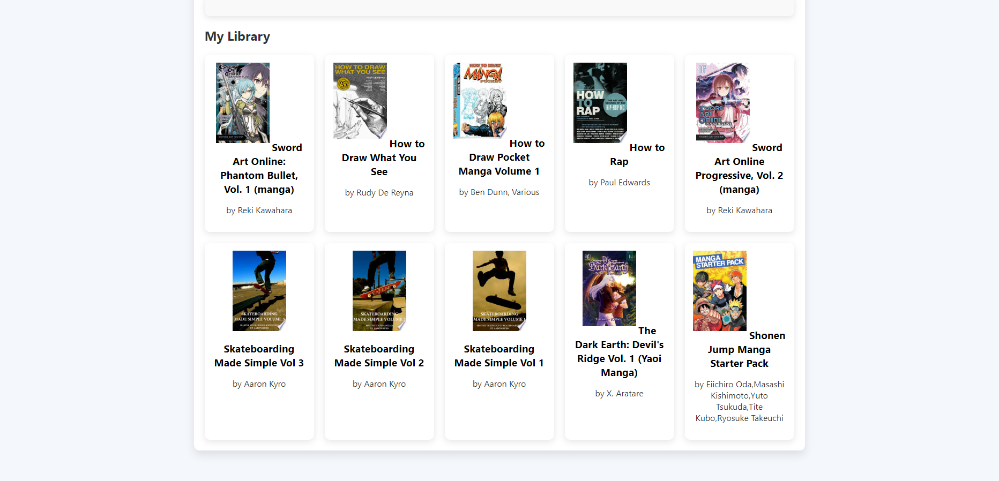

## Book Search 2.0 with Google Book API by Aniya Stanford

## Description
This project is a virtual library web application that enables users to search for books, view details, and browse through multiple pages of search results. The application integrates the Google Books API to dynamically fetch and display book information, offering a seamless and user-friendly experience.

## Table of Contents
- [Installation](#installation)
- [Usage](#usage)
- [Screenshots](#screenshots)

## Installation
1. Clone the repository:
   ```bash
   git clone https://github.com/stanfordaniya/BookSearch2.0.git

## Usage
The Book Search 2.0 application provides an intuitive interface for users to search for books, view details, and navigate through multiple pages of search results. Here’s how to use it:

1. **Search for Books**: 
   - Enter a keyword or book title in the search bar.
   - Click the **Search** button to initiate a query to the Google Books API.
   - The app will display a list of books matching your search term, showing the title, author(s), and cover image.

2. **View Book Details**:
   - Click on any book title to view more details.
   - This includes information such as the book’s description, publisher, and publication date (when available).

3. **Pagination**:
   - Use the pagination buttons at the bottom of the results to navigate through additional pages if your search query returns many books.
   - Each page displays a new set of books, allowing for easy browsing of all search results.

This app is designed to be user-friendly, enabling users to explore an array of books with just a few clicks. Enjoy discovering new reads and diving into book details seamlessly!

## Screenshots
### Example One:


### Example Two:


### Example Three:


### Example Four:


### Example Five:

